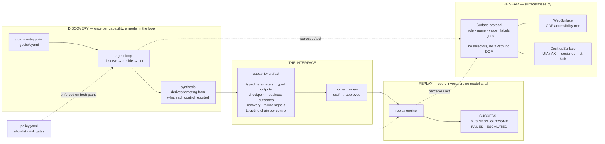
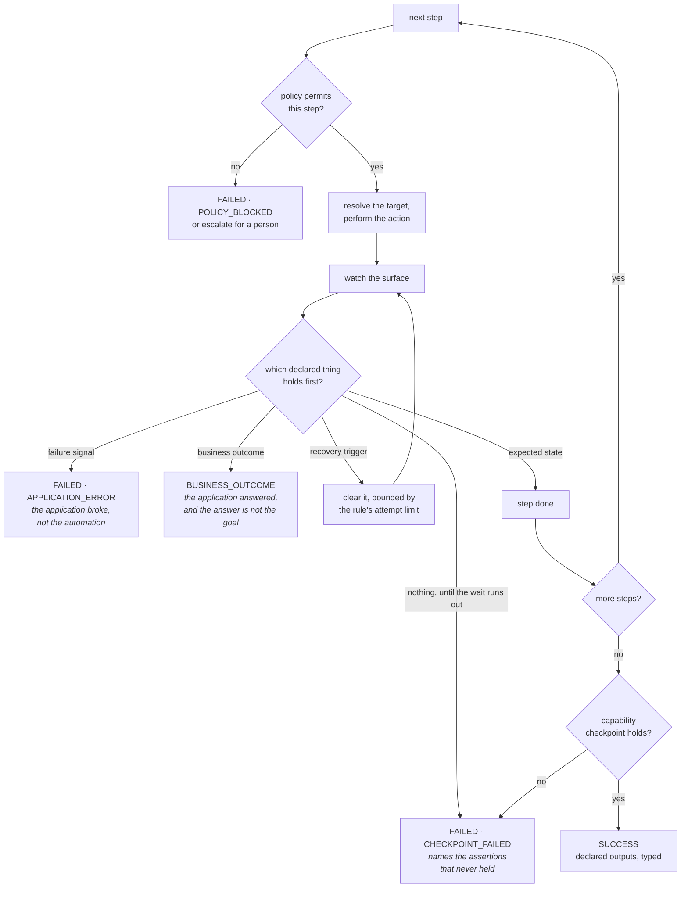
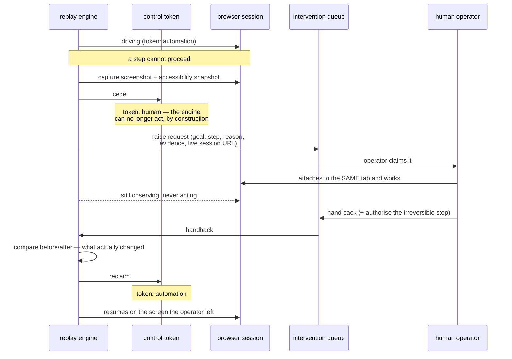

# Design write-up

## 1. Architecture

Two halves meet at one artifact. Discovery runs once per capability and is expensive and non-deterministic. Replay runs on every invocation with no model consulted at any point. The artifact is the whole interface between them, which is why most decisions below are really decisions about the artifact.

The load-bearing decision is that `Observation` is a value, not a live handle. A surface reports what an operator could see: roles, accessible names, the text beside unlabelled controls, grids. Everything above works on that snapshot, so the logic most likely to operate the wrong record is testable exhaustively without a browser, and a new surface only has to produce an `Observation` to inherit every strategy, assertion and extraction unchanged.

The second is perceiving through the accessibility tree instead of the DOM, and acting by invoking the node it returns instead of clicking a coordinate. Role, name and value are what Windows UIA and macOS AX expose over native widgets, and `invoke()` is named after `InvokePattern.Invoke()`. It also removes scrolling and overlays as sources of flake. The cost is blindness to whatever the tree omits; for a canvas-rendered application the answer is a different `Surface`, not a change above it.

## 2. Artifact schema

A capability is a contract, not a recording. A step list says what happened once. A contract says what a caller may ask for, what it gets back, which non-success answers are legitimate, and how anyone can tell whether the flow worked. Only a contract is safe to invoke unattended. So it declares typed parameters and outputs, a checkpoint, business outcomes, recovery rules and failure signals. `as_tool_definition()` renders it as a callable tool whose description names the outcomes, so a calling agent knows in advance that `MEMBER_NOT_FOUND` is an answer it may receive.

Artifacts are JSON files because they are reviewable documents: a change shows up as a diff in code review, the cheapest approval workflow an institution will actually use.

Three specifics worth defending.

**Steps bind parameter references, never values.** That is what makes a recording reusable instead of a transcript of one run, and it means no credential is ever written into an artifact, because there is nothing stored to redact.

**A target is an ordered chain of strategies, not a locator.** The application forced this. Its search field resolves by role and accessible name. Its sub-account form supplies two inputs with an empty accessible name, distinguishable only by the adjacent table cell. One strategy provably cannot serve both. Each carries its own rationale and confidence, and replay reports which one resolved, so a capability quietly surviving on its last resort is visible.

**Business outcomes are declared in the artifact**, which makes "no such member is an answer, not a crash" a versioned, reviewable property of the capability instead of an accident of whoever wrote the exception handler.

The schema validates itself, rejecting at load time a step that binds an undeclared parameter, non-consecutive indices, duplicate outcome codes, or a sensitive parameter carrying an example. That last rule came from a test: an example is documentation, documentation gets committed, and a sample credential in a reviewed file is a leak.

## 3. Determinism & error handling

Determinism does not come from recording timings and reproducing them, which is what makes recorded automation flaky. It comes from three refusals. Nothing waits for a duration; every wait is for an observable condition, so a step completes when the surface is ready and fails with a named unmet expectation when it does not. Nothing resolves ambiguously; a strategy matching several controls is skipped, because picking the first of three is how automation silently opens the wrong member's record. Nothing is assumed to have worked; checkpoints are asserted, so a click that did nothing fails at the step that did nothing.

The loop watches four declared things at once and the first to hold decides. Detection is uniform; only the response differs, which is what keeps the not-found-is-an-answer rule out of an exception handler.

`SUCCESS` and `BUSINESS_OUTCOME` are both successful replays, and `replay_worked` is written once so no caller reinvents `status == SUCCESS` as the test for "did this work". Failures carry a specific kind, so an on-call engineer reads "the Initial Deposit field could not be resolved at step 9", not "replay failed". Recoveries are deliberately not a fifth status: clearing a known interstitial is something replay does while succeeding, so it is recorded on the result instead of becoming it.

`failure_signals` exists because of a gap found by running it. Without a declared notion of application failure, an error page resolved as "the expected state never arrived" and was reported ten seconds later as a timeout, which is slow and blames the wait instead of the error on screen.

Recovery is bounded twice: by each rule's attempt limit, and by a refusal to re-authenticate once an irreversible step has run, since replaying would submit it twice.

## 4. Heterogeneity & multi-tenant

**The surface seam.** `surfaces/base.py` is the intersection of what web accessibility trees and platform accessibility APIs both provide: role, name, value, contextual labels, grids, and invoking a control. No selectors, XPath or DOM types appear in it or in anything that consumes it. A legacy web application is the same implementation with worse names, which shifts more targets onto the adjacent-cell strategy. A desktop application is a new `Surface` mapping UIA or AX to the same `Observation`; the artifact, resolver, replay engine and escalation are untouched.

This is enforced, not intended. `tests/test_seam.py` imports the artifact schema, resolver and replay engine in a clean interpreter and fails if a browser comes with them. A design claim decays quietly, and one convenience import during a debugging session would make the abstraction fiction while still passing review.

The honest limit: a screenshot-and-coordinates surface needs a new member of the strategy union, because nothing in the schema is positional in pixel space. The schema accommodates that; it does not contain it.

**Multi-tenant.** A capability is recorded against a product, not a tenant, which is why `Surface` carries `application`, `tenant` and `variant_of` instead of a bare URL. The model is a shared base plus sparse per-tenant overrides: a tenant that brands the vendor product differently stores only what differs, so a fix to the base propagates instead of being re-applied a hundred times.

Two details are designed and not built. Overrides must key on a stable step identifier, not an index, because indices move whenever the base is re-recorded; the review scripts locate steps by intent for exactly this reason. And the number of overrides is itself a signal. Past a threshold a tenant is not a variant, and pretending otherwise produces a capability nobody can reason about.

**Drift** is detected from evidence the system already emits: which strategy resolved, at what confidence, how often recovery fired. A per-tenant canary replay compared against that profile catches a vendor upgrade before a real invocation does. Divergence opens a review; it never auto-repairs.

## 5. Escalation & handoff

The requirement is worded precisely: the operator takes over "the same live session the automation was using, not a fresh one". A second browser would lose the signed-on session, the half-completed form and the history, which is most of what an operator needs. So the browser runs with a debugging port and the request carries a URL onto that tab, served locally so an operator on an institution's network needs no internet access.

"Stuck" is not a heuristic. It is any failure of an escalatable kind: an unresolvable control, a checkpoint that never held, a recovery out of attempts, an application error, a blocked step. A malformed argument is not escalatable, because no operator attention fixes it and escalating what nobody can resolve trains operators to dismiss requests.

The surface is wrapped so that acting without the token raises rather than being discouraged. That rule is exactly the kind that survives review and then fails at three in the morning when a retry path forgets to check. Observing stays permitted, which is what makes the independent record possible: a handback carries what the operator decided, what they say they did, and separately what the automation watched change. They can also authorise the irreversible step as part of handing back, scoped to that invocation and recorded against their name, which is the brief's "require confirmation" made concrete.

The operator console is a CLI. A production one would add presentation and routing, and no part of the control-transfer model, which lives in the engine and the queue.

## 6. Safety

The allowlist is a YAML file so that someone who is not an engineer can read and change it, enforced at the action boundary on both execution paths, because "must not act outside the allowlist" is a statement about every action. It controls origins and routes, since on a servicing console reading a member and administering the institution share a host.

The discovery agent's tool surface is built from the policy, so a forbidden action is never offered: a refusal the model never sees is one it cannot work around. The execution check remains, because a tool surface shapes what is likely and a guardrail must handle what is possible.

Irreversible steps get three gates. Policy must permit them, the capability must be approved, and the caller must authorise them per invocation, or a named operator must authorise them on the live session. Three, because the failure modes are not symmetric. A blocked transfer is an inconvenience resolved in minutes. An unintended one is money that has moved against a real member's account and is discovered later. Where costs are that lopsided, the default belongs on the recoverable side.

Redaction has two independent layers, because one mechanism means one mistake is enough. Structurally, sensitive values are never stored: steps hold parameter references, and sensitive outputs become secrets the moment they are read. By pattern, captured text is scrubbed of SSNs, dates of birth, emails and card numbers, which the automation never handled but which were on screen when a snapshot was taken. Nothing sensitive appears anywhere in `evidence/`, checked rather than asserted.

Three limits, named rather than left to be found. Pattern redaction recognises shapes, not meanings, so it will never catch a member's name, which is why the structural layer exists. A failure screenshot necessarily shows whatever was on screen; in production it would be encrypted at rest with short retention. And a discovery run can perform an irreversible action, because nothing has classified it yet: risk is an output of review, not an input to discovery, so recording must run against a non-production instance.

## 7. Cuts

Cut on purpose, with the seam left real:

- **Desktop and screenshot surfaces.** The `Surface` protocol is the deliverable, enforced by a test.
- **Multi-tenant override resolution.** Designed in §4 and present in the schema; no resolver written. Building tenant plumbing before a second tenant exists is the infrastructure the brief warns against.
- **The operator console.** A CLI, not co-browsing. The control transfer it drives is real.
- **Outcome discovery.** A run that succeeds cannot observe what happens otherwise, so business outcomes, recovery and risk classification are added at review. Visible in `evidence/`: runs 05 and 06 are the same unknown member against the draft and the reviewed capability.
- **Concurrency, queues, persistence.** One process, files on disk. Production moves artifacts into object storage behind the same `store.py`, and the intervention queue into a real queue behind the same interface. Neither changes anything above them, which is the point of putting them behind an interface now and building neither.

Next, in order: probe runs that deliberately provoke each error path and record its signature, the largest gap between what this does and what it should; stable step keys and the override resolver; a per-tenant canary schedule using the confidence data replay already emits; and a second surface, because the seam is argued until something else satisfies it.

What I would not build, and would push back on being asked to: automatic repair of a drifted capability. The system detects drift and opens a review. A system that silently adapts to a changed screen will eventually adapt to the wrong one, inside software that moves money.
