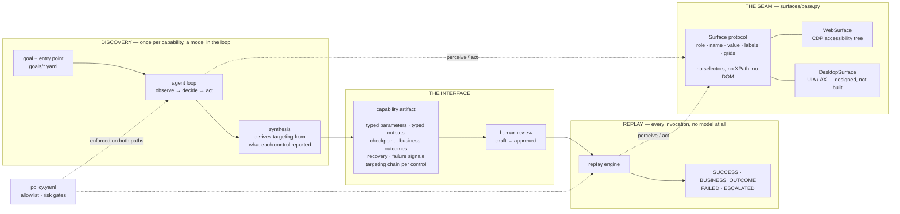
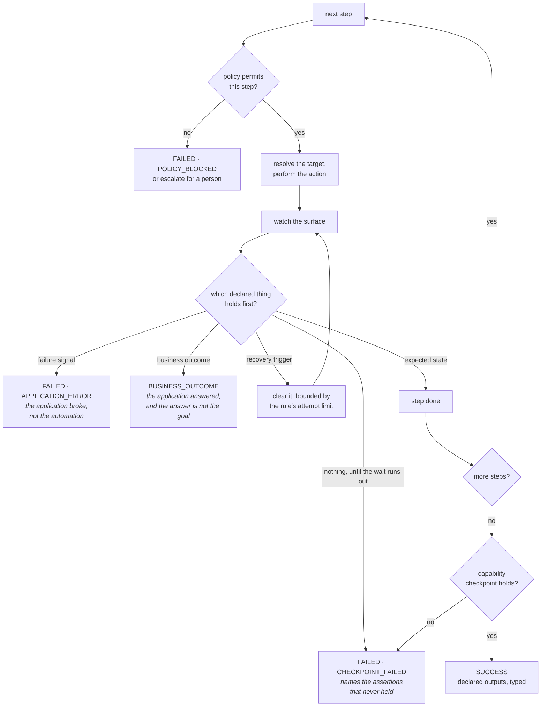
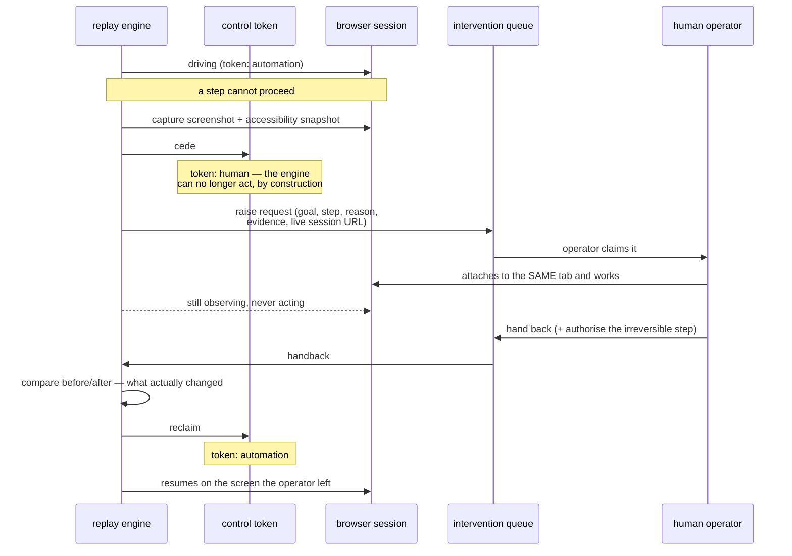

# Design write-up

A model drives a real UI once to reach a goal. That run becomes a typed, versioned capability artifact, replayed thereafter with no model in the decision loop, under an explicit error taxonomy, an enforced allowlist, and a path for handing the live session to a person.

## What was built, and what it does

Two capabilities were recorded by `claude-opus-5` against a mock core banking console, then reviewed by hand. Every row below is a committed run in [`evidence/`](./evidence/README.md).

| run | outcome |
|---|---|
| discovery: read a balance | 7 actions, 20s, $0.03 |
| discovery: open a sub-account | 12 actions, 32s, $0.13 |
| replay, recorded member | `SUCCESS` · balance `4182.55` |
| replay, member never recorded | `SUCCESS` · balance `217.09` |
| unknown member, **draft** capability | `FAILED` · `TARGET_UNRESOLVED` at step 6, both strategies named |
| unknown member, **reviewed** capability | `BUSINESS_OUTCOME` · `MEMBER_NOT_FOUND` |
| unexpected interstitial injected | `SUCCESS`, one bounded recovery |
| session expired mid-flow | `SUCCESS`, re-authenticated and replayed |
| application error injected | `FAILED` · `APPLICATION_ERROR` in 731ms |
| irreversible step, no authorisation | escalated; operator authorised on the live session; `SUCCESS` |
| unrecoverable error mid-flow | escalated; operator worked the same session by hand and said where to resume; `SUCCESS` |
| restricted member | `BUSINESS_OUTCOME` · `SERVICING_NOT_PERMITTED` |
| deposit below the minimum | `BUSINESS_OUTCOME` · `DEPOSIT_REJECTED` |
| unexpected `confirm()` dialog | dismissed, recorded, `SUCCESS` |
| an agent invoking a capability by name | picked the tool, supplied typed args, answered in English |

142 tests. Replay, escalation and the guardrails run with no API key and no network.

Those rows cover every runtime condition §3.3 names: a validation error, a "record not found" result, a permission denial, an unexpected dialog, a session timeout, and a failed load.

The last row is the through-line closing. An agent is asked a question in English, reads the catalog, and invokes `member_savings_balance(member_id="100234")`. It never sees the application. Asked about a member who does not exist, it relays `MEMBER_NOT_FOUND` as an answer rather than retrying, because the tool description told it that was a possible result. The credentials are not in the schema it was shown: a model asked for a password would have to be handed one to put in the argument.

Each of those replays also returns the member's name. It does not appear in the table, or in any evidence file, because it is declared a sensitive output: returned to the caller who asked for it, withheld from a log that outlives the request.

The two rows to compare are the draft and the reviewed capability. Same input, same code. The draft fails because a discovery run cannot observe what the console does when a member does not exist; review adds that, and the answer becomes data the caller can act on.

## 1. Architecture

### The choices §4 leaves open

| decision | choice | why |
|---|---|---|
| language, runtime | Python 3.11, Pydantic | the artifact is the centrepiece, and Pydantic gives typed models, load-time validation and JSON Schema from one definition |
| model, and how the loop is structured | `claude-opus-5` with tool use; one action per turn, adaptive thinking | actions *are* tool calls, so every decision arrives structured and logged with no prose to parse. The model is shown a numbered list of controls and answers with a number; it never writes a locator |
| computer-use technology | Playwright as transport, CDP accessibility tree for perception | the tree is what survives a surface with no clean DOM, and it is the vocabulary UIA and AX also speak. Playwright is a driver here, not an abstraction |
| target application | a local console built for this: frameset, nested layout tables, ASP.NET control names, no test IDs, and a form with no accessible names at all | it lets the runtime conditions §3.3 names be injected on demand, which a public site will not do reliably. No terms, no rate limits, no real credentials or PII |
| schema storage | Pydantic models serialised to JSON, one file per version | artifacts are reviewable documents: a change to a capability is a diff in code review |
| determinism | ordered strategy chain, waits on conditions, asserted checkpoints | detailed in §3 |
| architecture | one process, files on disk, no queue or database | there is no second consumer yet. FastAPI appears only inside the mock console, never in the system |

Building the target myself means controlling both sides, which is a fair criticism. The mitigation is that it was made harder than it needed to be in the way that counts: its sub-account form supplies two inputs with no accessible name, which is what forced targeting to become an ordered chain rather than a single locator.

`Observation` is a value, not a live handle: a snapshot of roles, accessible names, the text beside unlabelled controls, and grids. Consequences: target resolution is testable exhaustively without a browser, and a new surface only has to produce an `Observation`.

Actions invoke the node the accessibility tree returns rather than clicking a coordinate, which is what UIA's `InvokePattern` does and what removes scrolling and overlays as sources of flake.

Each of those decisions costs something, and the costs are worth stating rather than discovering:

- **Perceiving through the accessibility tree** is blind to whatever the tree does not expose. A canvas-rendered application needs a different `Surface`, and a badly built page can be invisible to this system while being usable by a sighted operator.
- **Observation as a snapshot** means a screen can change between observing and acting. Every action re-observes first, which costs a round trip per step and is why replay takes a second rather than a tenth of one.
- **One process and files on disk** means no concurrent replays of the same capability and no history beyond the filesystem. It is the right size for one institution's tooling and the wrong size for a fleet, which is a migration rather than a redesign because both sit behind interfaces.

## 2. Artifact schema

A capability is a contract, not a recording: typed parameters and outputs, a checkpoint, business outcomes, recovery rules, failure signals. `as_tool_definition()` renders it as a callable tool whose description names the outcomes, so a calling agent knows `MEMBER_NOT_FOUND` is a possible answer before it calls. Steps bind parameter references, never values. That makes a recording reusable, and means no credential is stored in an artifact.

A target is an ordered chain of strategies, because the application forces it: its search field resolves by role and accessible name, while its sub-account form supplies two inputs with an *empty* one, separable only by the adjacent table cell. Each strategy carries a rationale and a confidence, and replay reports which resolved. Business outcomes are declared in the artifact, so "no such member is an answer" is versioned and reviewable instead of living in an exception handler.

The schema rejects, at load time, a step binding an undeclared parameter, non-consecutive indices, duplicate outcome codes, and a sensitive parameter carrying an example value. The last rule came from a test: an example is documentation, documentation is committed, and a sample credential in a reviewed file is a leak.

## 3. Determinism & error handling

Three refusals. Nothing waits for a duration; every wait is for an observable condition. Nothing resolves ambiguously; a strategy matching several controls is skipped, since picking the first of three is how automation opens the wrong record. Nothing is assumed to have worked; checkpoints are asserted.

`SUCCESS` and `BUSINESS_OUTCOME` are both successful replays; `replay_worked` exists so callers do not use `status == SUCCESS` as that test. Failures carry a kind, so the log reads "the Initial Deposit field could not be resolved at step 9". Recoveries are recorded on the result, not as a status.

`failure_signals` was added after running it: without a declared notion of application failure, an error page surfaced as a checkpoint timeout ten seconds later. Declared, it is reported in 731ms.

Recovery is bounded twice: by each rule's attempt limit, and by refusing to re-authenticate once an irreversible step has run, since replaying would submit it twice.

UI drift is secondary in this environment, because these applications change slowly, and the design treats it as a reporting problem rather than a recovery one. Every replay records which strategy resolved a target and at what confidence, so a capability that begins resolving through a lower-confidence fallback has visibly drifted before it fails outright. No new machinery detects this; it is already in the log. §4 describes how that signal is used across tenants. A drifted capability is never repaired automatically: it fails or it escalates, and a person decides.

## 4. Heterogeneity & multi-tenant

`surfaces/base.py` is the intersection of what web accessibility trees and platform accessibility APIs both provide: role, name, value, contextual labels, grids, invoking a control. No selectors, XPath or DOM types appear in it or in anything consuming it.

- **Legacy web**: the same implementation with worse names, which shifts targets onto the adjacent-cell strategy. Already exercised — the sub-account form has no accessible names at all.
- **Desktop**: a new `Surface` mapping UIA or AX onto the same `Observation`. `surfaces/desktop.py` is a documented stub that names the platform call behind every method, and a test asserts it provides the whole protocol, so "nothing above changes" is checked rather than claimed. Three things genuinely differ and are written down there: frames become windows, `navigate` launches rather than fetches, and the handoff needs a real remote session instead of a debugging URL.
- **Screenshot and coordinates**: needs a new member of the strategy union, since nothing in the schema is positional in pixel space. The schema accommodates it; it does not contain it.

`tests/test_seam.py` imports the artifact schema, resolver and replay engine in a clean interpreter and fails if a browser comes with them. One convenience import during debugging would otherwise make the abstraction fiction while still passing review.

**Multi-tenant.** A capability is recorded against a product, not a tenant, which is why `Surface` carries `application`, `tenant` and `variant_of`. The model is a shared base plus sparse per-tenant overrides, so a fix to the base propagates rather than being re-applied per institution. Two details are designed and not built: overrides must key on a stable step identifier rather than an index, because indices move when a base is re-recorded; and the number of overrides is itself a signal that a tenant should stop being a variant.

**Drift**, per tenant, uses the signal §3 describes. A canary replay with known inputs, compared against that tenant's usual profile of resolved strategies and recovery rates, catches a vendor upgrade before a real invocation meets it.

## 5. Escalation & handoff

The operator takes over the same live session, not a fresh one: a second browser would lose the signed-on session and the half-completed form. The browser runs with a debugging port and the request carries a URL onto that tab, served locally so no internet access is required.

"Stuck" is any failure of an escalatable kind: an unresolvable control, a checkpoint that never held, a recovery out of attempts, an application error, a blocked step. A malformed argument is not escalatable, because no operator can fix it.

The surface is wrapped so that acting without the token raises, and observing stays permitted, which is what allows an independent record. In run 12 the operator cleared an error page by hand and the log holds both their account and the automation's: *"controls appeared: button 'Search', textbox 'Member ID'"*. They can authorise the irreversible step as part of handing back, scoped to that invocation and recorded against their name.

The operator console is a CLI. A production one adds presentation and routing, and no part of the control-transfer model.

## 6. Safety

The allowlist is a YAML file, readable by someone who is not an engineer, enforced at the action boundary on both execution paths. It controls origins and routes, since on a servicing console reading a member and administering the institution share a host. The tool surface offered to the discovery agent is built from it, so a forbidden action is never offered; the execution check remains, because a tool surface shapes what is likely and a guardrail handles what is possible.

Irreversible steps have three gates — policy permits, capability approved, caller authorises per invocation (or a named operator does, on the live session). Three because the costs are asymmetric: a blocked transfer is resolved in minutes, an unintended one is money that has moved.

Redaction has two independent layers. Structurally, sensitive values are never stored. By pattern, captured text is scrubbed of SSNs, dates of birth, emails and card numbers, which were on screen rather than handled as values. Nothing sensitive appears in `evidence/`, checked rather than asserted.

Three limits: pattern redaction recognises shapes, not meanings, so it will never catch a member's name; a failure screenshot shows whatever was on screen, and in production would be encrypted at rest with short retention; and a discovery run can take an irreversible action, because risk is an output of review rather than an input to discovery, so recording must run against a non-production instance.

## 7. Cuts

- **Desktop and screenshot surfaces.** The protocol is the deliverable, and `surfaces/desktop.py` stubs it with the platform mapping for each method. Two tests hold the seam: one fails if the artifact or replay engine ever import a browser, the other if a method is added that only a browser could satisfy.
- **Multi-tenant override resolution.** Designed above and present in the schema; no resolver written. Tenant plumbing before a second tenant exists is the infrastructure the brief warns against.
- **Operator console.** A CLI, not co-browsing. The control transfer it drives is real.
- **Outcome discovery.** Business outcomes, recovery and risk classification are added at review, because a run that succeeds cannot observe what happens otherwise. Runs 05 and 06 in `evidence/` show the difference this makes.
- **Concurrency, queues, persistence.** Production moves artifacts into object storage behind the same `store.py`, and the queue behind the same interface. Neither changes anything above them, which is why they are interfaces now and nothing more.

One stretch goal is taken, and only one: the agent-facing capability interface, with an agent shown invoking a capability by name. The approval gate is not counted as a second, because it belongs to the safety model in §6 rather than being extra. Scoring artifacts by replay reliability, code generation, assisted fallback and cross-tenant canonicalisation are all untouched.

Next: probe runs that deliberately provoke each error path and record its signature; stable step keys and the override resolver; a per-tenant canary schedule; a second surface, because the seam is argued until something else satisfies it.

I would not build automatic repair of a drifted capability. The system detects drift and opens a review. A system that silently adapts to a changed screen will eventually adapt to the wrong one, inside software that moves money.
